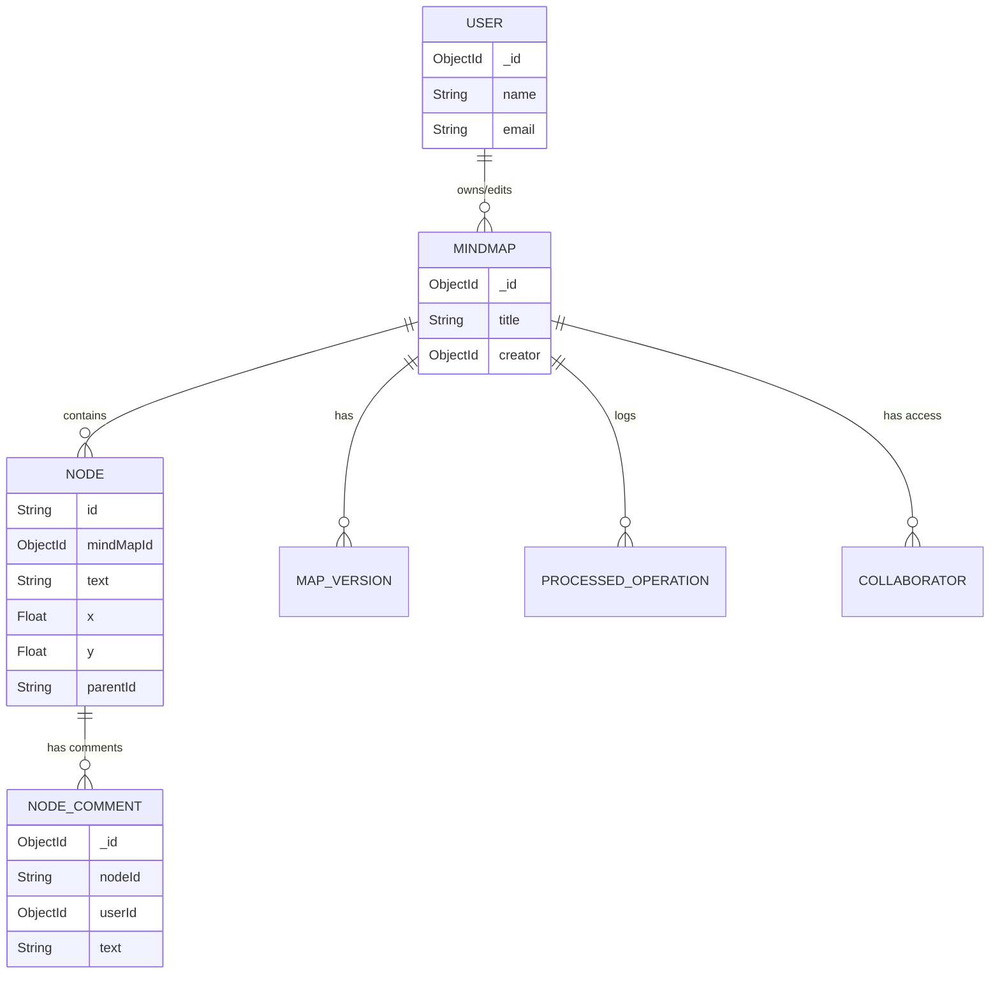
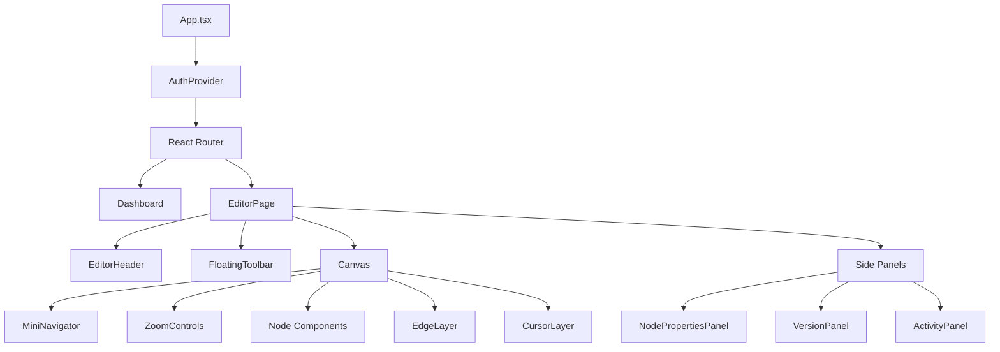
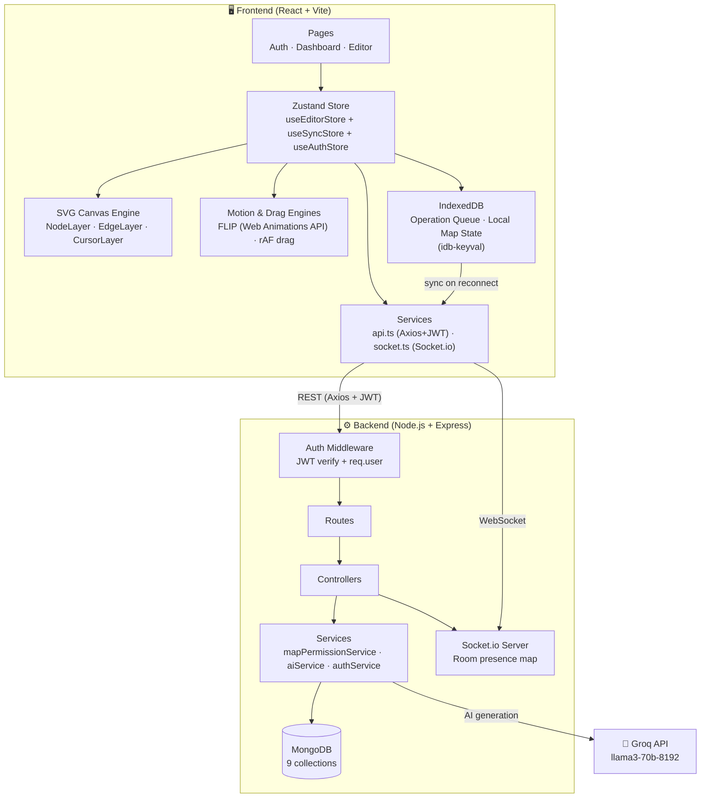
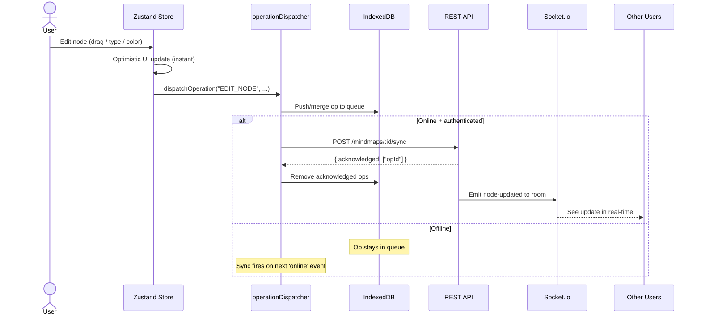
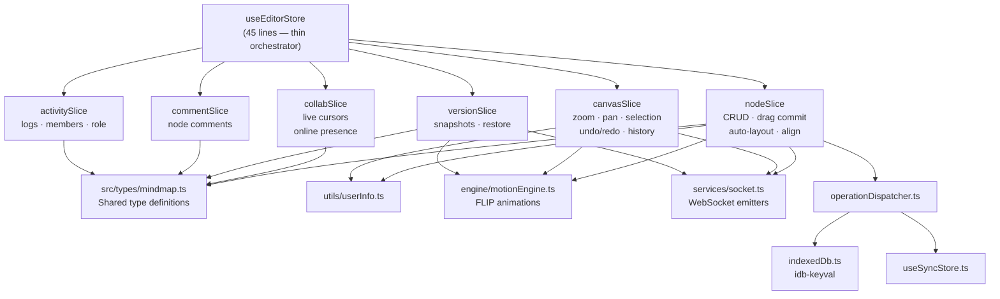
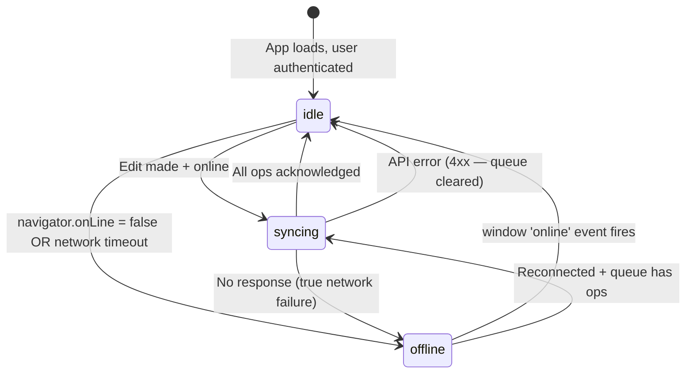
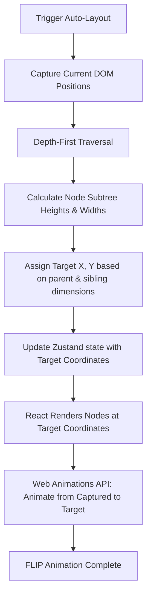
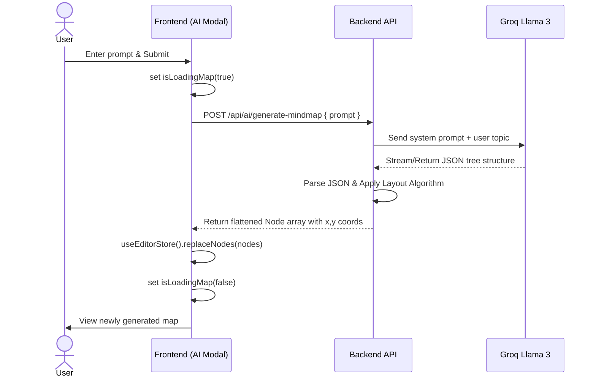

# 🧠 MindMap Pro — Collaborative Infinite Canvas Engine

[](https://react.dev/)
[](https://www.typescriptlang.org/)
[](https://vitejs.dev/)
[](https://zustand-demo.pmnd.rs/)
[](https://socket.io/)
[](https://groq.com/)
[](LICENSE)
[](https://nodejs.org/)

> **A real-time collaborative mind mapping application** built on a custom SVG infinite canvas engine with offline-first editing, WebSocket-based multi-user sync, AI-powered map generation via Groq, and a zero-re-render drag system — designed to rival tools like Miro and Whimsical at the architecture level.

---

## 🔗 Repository Navigation

| Resource | Link |
|---|---|
| 🖥️ **Frontend Repo** (this) | `mindmap-client` |
| ⚙️ **Backend Repo** | [`mindmap-server`](../mindmap-server) |
| 📡 **API Reference** | [API Reference →](#-api-reference-summary) |
| 🏗️ **Architecture** | [Architecture →](#️-architecture) |
| 🚀 **Getting Started** | [Setup →](#-getting-started) |

---

## 🌐 Live Demo & Previews

> 🔗 **Live App:** `https://your-app.vercel.app` *(deploy and update this link)*
>
> 📹 **Video Walkthrough:** `https://your-loom-link` *(record a 2-min Loom)*
>
> 📦 **Backend API:** `https://your-api.railway.app`

### Screenshots

| Infinite Canvas | AI Generation & Collaboration |
|:---:|:---:|
|  |  |

| Focus Mode | Node Properties & Comments |
|:---:|:---:|
|  |  |

> 📝 **To add real screenshots:** Place images in `docs/` in the repo root and update the URLs above, or use GitHub's issue upload trick (drag images into an issue, copy the URL).

---

## 💡 Project Motivation

Most collaborative mind mapping tools (Miro, Whimsical, XMind) are **closed-source, subscription-gated, and treat maps as read-only in offline mode**. MindMap Pro was built to explore:

1. **How far you can push a custom SVG canvas** before needing WebGL — turns out, very far.
2. **Offline-first collaborative editing** without full CRDTs (using operation queuing + Last Write Wins).
3. **Real-time multi-user state** without a specialized backend (Yjs, Liveblocks) — built directly on Socket.io rooms.

The result is a production-grade architecture that maps onto real engineering problems at companies building collaborative software.

---

## 📖 Table of Contents

- [🚀 Features at a Glance](#-features-at-a-glance)
- [⚙️ Engineering Challenges](#️-engineering-challenges)
- [⚡ Performance Optimizations](#-performance-optimizations)
- [🧭 System Design Principles](#-system-design-principles)
- [🏗️ Architecture](#️-architecture)
- [📴 Offline Sync](#-offline-sync)
- [🛠️ Editor](#️-editor)
- [🤖 AI Mindmap Generation](#-ai-mindmap-generation)
- [🤝 Real-Time Collaboration](#-real-time-collaboration)
- [👥 Sharing & Permissions](#-sharing--permissions)
- [💬 Node Comments](#-node-comments)
- [⏳ Version History & Activity](#-version-history--activity)
- [🔍 Focus Mode](#-focus-mode)
- [📦 Export System](#-export-system)
- [🗂️ Templates](#️-templates)
- [📂 Project Structure](#-project-structure)
- [🧰 Tech Stack](#-tech-stack)
- [🚦 Getting Started](#-getting-started)
- [⌨️ Keyboard Shortcuts](#️-keyboard-shortcuts)
- [🤝 Contributing](#-contributing)
- [🔭 Roadmap](#-roadmap)
- [📈 Scalability Considerations](#-scalability-considerations)

---

## 🚀 Features at a Glance

| Category | Features |
|---|---|
| **Canvas** | SVG Infinite Canvas · Pan · Zoom · Mini Navigator · Lasso Selection |
| **Nodes** | Rich properties · Color coding · Font size · Notes · Collapse/expand |
| **Layout** | Recursive Auto-Layout (FLIP animated) · Align · Distribute · Fit to Screen |
| **Offline** | Operation queue (IndexedDB) · Sync on reconnect · Last-Write-Wins conflict resolution |
| **AI** | One-prompt mindmap generation via Groq Llama 3 70B |
| **Collaboration** | Live Cursors · Presence Avatars · Edit Locking · Remote Selection |
| **Sharing** | Role-Based Permissions (Owner / Editor / Viewer) · Invite by Email |
| **Comments** | Threaded per-node discussion panels · Real-time via WebSocket |
| **History** | Infinite Undo/Redo · Version Snapshots · Activity Log |
| **Focus Mode** | Subtree isolation with fade-out · One-click exit pill |
| **Exports** | PNG · PDF · JSON · Markdown |
| **Templates** | Pre-built map blueprints (Startup, Project, Study, Brainstorm) |
| **Auth** | JWT Authentication · Persistent sessions · Protected routes |

---

## ⚙️ Engineering Challenges

### 1. Zero-Re-render Drag Engine
**Problem:** React's reconciler is too slow for 60fps drag on large graphs. Updating Zustand state on every `mousemove` event caused visible frame drops with 100+ nodes.

**Solution:** The drag engine bypasses React entirely during drag by mutating the SVG `transform` attribute directly via a DOM ref. React state is updated **only on `mouseup`**, keeping the component tree frozen while the canvas stays fluid.

```
mousemove → ref.current.setAttribute("transform", ...) → 60fps, zero re-renders
mouseup   → commitDragEnd() → Zustand update → React re-render (once)
```

### 2. Coordinate Space in SVG
**Problem:** Pan + zoom creates a transformed coordinate space. Click positions need to map accurately into "world coordinates" at any zoom level.

**Solution:** `getScreenCTM().inverse()` on the SVG viewport element gives the exact inverse transform matrix. Every mouse event runs through this to get precise world-space `(x, y)` — accurate from 0.1x to 3x zoom.

### 3. Offline-First Editing Without CRDTs
**Problem:** Supporting offline edits without full CRDT infrastructure (Yjs, Automerge) while still being safe for concurrent multi-user editing.

**Solution:** An operation queue in IndexedDB records every edit as a typed `Operation` object. On sync, the server applies **Last Write Wins** — operations older than `node.updatedAt` are discarded. The `ProcessedOperation` collection prevents double-apply on retry.

### 4. FLIP Layout Animation
**Problem:** Auto-layout repositions every node simultaneously, which is visually jarring if done with CSS transitions (nodes teleport).

**Solution:** FLIP (First, Last, Invert, Play) animation using the Web Animations API: capture all node positions **before** layout, compute new positions, then animate each node from its old position to its new one using `cubic-bezier(0.2, 0.8, 0.2, 1)`.

### 5. Focus Mode Without Render Loop
**Problem:** Computing which nodes are "inside the focused subtree" on every render caused an infinite loop because the `Set` reference changed each time, triggering Zustand subscribers.

**Solution:** The focused subtree `Set<string>` is computed with `useMemo` keyed on `[nodes, focusNodeId]`. The same reference is returned when the inputs haven't changed, which prevents `useSyncExternalStore` from triggering phantom re-renders.

### 6. Socket Reconnect Race Condition
**Problem:** On page load, Zustand's `persist` middleware hydrates the auth token asynchronously. The `online` event listener could fire `syncOperationQueue` before the token was ready, resulting in tokenless sync requests → 403s.

**Solution:** `syncOperationQueue` now reads from `useAuthStore.getState().token` as the first guard. If no token, sync aborts silently. The token will be present on the next trigger.

---

## ⚡ Performance Optimizations

| Optimization | Technique | Impact |
|---|---|---|
| **Drag rendering** | Direct DOM mutation via `ref`, bypasses React | 0 re-renders during drag |
| **Cursor smoothing** | `requestAnimationFrame` lerp loop (`ease = 0.25`) | 60fps cursor for all peers |
| **Operation compression** | Merge consecutive `MOVE_NODE`/`EDIT_NODE` ops for same node | Smaller sync payloads |
| **Batch sync** | Single `POST /sync` with all queued ops instead of one-per-op | Fewer HTTP round trips |
| **Subtree memoization** | `useMemo` BFS for Focus Mode subtree | Stable `Set` reference, no phantom renders |
| **FLIP animation** | Web Animations API, not CSS transitions | GPU-composited layout moves |
| **Socket debounce** | 1000ms disconnect delay guards against StrictMode double-mounts | No spurious reconnects |
| **replaceNodes** | Silent node replacement without unmounting Canvas | No canvas blink on AI generation |

---

## 🧭 System Design Principles

### Offline-First
Every edit dispatches an `Operation` to a local IndexedDB queue **before** any network call. The network sync is opportunistic — latency or downtime never blocks the user.

### Optimistic UI Updates
Node changes appear instantly in the local Zustand store. The server sync and Socket.io broadcast happen after, in the background. Users never wait for a server round-trip to see their own edits.

### Idempotent Operations
Each operation carries a client-generated UUID (`operationId`). The server's `ProcessedOperation` collection tracks applied IDs — retrying a failed sync batch is always safe, since duplicates are detected and skipped.

### Event-Driven Collaboration
All multi-user state flows through Socket.io events scoped to a map room. The server is the single authority for relay — it doesn't store ephemeral state like cursor positions. If a user disconnects, their cursor and edit lock are cleaned up automatically by the disconnect handler.

### Separation of Concerns via Slices
The editor state is split into 6 Zustand slices (`canvasSlice`, `nodeSlice`, `collabSlice`, `versionSlice`, `commentSlice`, `activitySlice`), each owning one concern. The top-level `editorStore.ts` is a thin 45-line orchestrator that composes them.

### Zero Circular Dependencies
Type imports that previously caused circular dependency chains (`socket.ts` importing from `editorStore.ts`) have been broken out into `src/types/mindmap.ts` — a shared type-only module imported by both.

---

## 🏗️ Architecture

### Database Entity Relationship Diagram (ERD)

The system relies on a NoSQL document database (MongoDB), but relationships are strictly enforced at the application level to maintain data integrity across collaborative sessions.



### Frontend Component Hierarchy

The frontend is highly modularized to prevent unnecessary re-renders in the infinite canvas execution path.



### Full System Architecture



### End-to-End Edit Flow



### Zustand Store Slice Graph



---

## 📴 Offline Sync

MindMap Pro is **offline-first**. Every edit is preserved locally even without internet and automatically synced when connectivity returns.

### Sync State Machine



### Operation Types

| Type | Triggered By | `payload` fields |
|---|---|---|
| `CREATE_NODE` | Adding a new node | `text, parentId, x, y, color, fontSize` |
| `MOVE_NODE` | Drag commit on `mouseup` | `x, y` |
| `EDIT_NODE` | Text / color / notes changes | `text?, color?, notes?, fontSize?` |
| `DELETE_NODE` | Node deletion | _(empty — nodeId in op root)_ |

### Key Files

| File | Responsibility |
|---|---|
| `store/operationDispatcher.ts` | Create, compress, and queue ops; trigger sync |
| `store/indexedDb.ts` | IndexedDB persistence via `idb-keyval` |
| `store/useSyncStore.ts` | `networkStatus` · `syncLock` · `lastSyncTimestamp` |
| `app/App.tsx` | `window online/offline` listeners; sync on reconnect |

---

## 🛠️ Editor

### Infinite Canvas
Rendered entirely in **SVG** for full control over transformations, animations, and event delegation. A custom pan/zoom layer applies a `transform` matrix using `getScreenCTM().inverse()` to map screen coordinates into world coordinates — accurate at any zoom level (0.1x–3x).

### Node Management
- **Create**: Click ⊕ on any node, press `Tab`, or use the floating toolbar.
- **Edit**: Double-click or press `Enter` for inline text editing.
- **Rich Properties Panel**: Slide-in sidebar with title, multi-line notes, color palette, and font-size controls.
- **Color Coding**: Six curated colors (Coral, Orange, Green, Blue, Purple, Teal).
- **Collapse/Expand**: Toggle subtree visibility with animated entrances/exits.

### Auto-Layout & Alignment



- **Recursive Auto-Layout**: A depth-first algorithm that calculates the bounding box of each subtree recursively. It positions children nodes avoiding vertical overlap by dynamically spacing them based on the computed heights of their descendants.
- **FLIP Animation Engine**: Because React state updates instantly snap nodes to their new coordinates, the Web Animations API is used to capture positions *before* the render paint, and smoothly animate them from their old positions using a physically-based `cubic-bezier(0.2, 0.8, 0.2, 1)` easing.
- **Align Tools**: Left, Center, Right, Top, Middle, Bottom edge alignment.
- **Distribute Tools**: Evenly space selected nodes along horizontal or vertical axes.

---

## 🤖 AI Mindmap Generation

Click **✨ AI Generate** in the editor toolbar to generate a complete mindmap from a single topic prompt.

### AI Generation Execution Flow



**How it works in-depth:**
1. **Prompt Injection**: The user prompt is wrapped in a strict system prompt instructing Groq's `llama3-70b-8192` model to return a structured nested JSON indicating the tree hierarchy.
2. **Server-Side Rendering (Layout)**: Before returning the generated nodes, the backend runs a two-pass depth-first search (DFS) layout algorithm to compute subtree-centered `x,y` positions for every node so it renders beautifully on the canvas instantly.
3. **Optimistic Replacement**: The existing nodes are replaced silently via `replaceNodes` avoiding costly canvas unmounts, preserving the user's viewport matrix.

| Action | Sets `isLoadingMap` | Canvas unmounts | Use case |
|---|:---:|:---:|---|
| `loadNodes` | ✅ Yes | ✅ Yes | Initial page load |
| `replaceNodes` | ❌ No | ❌ No | AI generation, silent refresh |

---

## 🤝 Real-Time Collaboration

All editor events are synchronized via Socket.io with a room per `mapId`.

### WebSocket Event Map

| Event (client → server) | Event (server → client) | Payload |
|---|---|---|
| `cursor-move` | `cursor-moved` | `{ x, y, name, color }` |
| `node-editing` | `node-editing-started` | `{ nodeId, user }` |
| `node-editing-stopped` | `node-editing-stopped` | `{ nodeId }` |
| `selection-update` | `selection-updated` | `{ nodeIds, user }` |
| `node-added` | `node-added` | `NodeType` |
| `node-updated` | `node-updated` | `{ id, updates }` |
| `node-deleted` | `node-deleted` | `{ nodeId }` |
| `map-restored` | `map-restored` | `{ nodes, versionId }` |

**Live Cursors:** Mouse positions broadcast at ~20 Hz, smoothed with a `requestAnimationFrame` lerp loop (`ease = 0.25`) — 60fps cursor movement for all peers.

**Edit Locking:** When a user edits a node, peers see a colored glow border and name badge. Double-clicks from others are silently blocked. Lock releases automatically on edit end.

---

## 👥 Sharing & Permissions

| Role | Capabilities |
|---|---|
| **Owner** | Full control — edit, invite, remove members, delete map |
| **Editor** | Create, move, edit, delete nodes |
| **Viewer** | Read-only — canvas is non-interactive |

---

## 💬 Node Comments

Per-node threaded comment panels in the Node Properties sidebar. Stored in `NodeComment`, real-time via `comment-added` / `comment-deleted` WebSocket events.

---

## ⏳ Version History & Activity

- **Snapshots**: Named point-in-time saves. Restore broadcasts `map-restored` to all live collaborators.
- **Activity Log**: `NODE_CREATED`, `NODE_DELETED`, `NODE_EDITED`, `NODE_MOVED`, `NODE_COLOR_CHANGED` — with user, timestamp, and diff metadata.
- **Undo/Redo**: Full in-memory stack. `Ctrl+Z` / `Ctrl+Y`.

---

## 🔍 Focus Mode

Select any node → **⊙ Focus** in the toolbar → all outside nodes fade to 15% opacity. A pill at the top reads "Viewing Subtree · Exit Focus". Subtree computed via `useMemo` BFS for a stable `Set<string>` reference.

---

## 📦 Export System

| Format | Method |
|---|---|
| **PNG** | `html-to-image` captures the SVG viewport |
| **PDF** | Same capture piped into `jsPDF` |
| **JSON** | `GET /api/mindmaps/:id/export/json` |
| **Markdown** | `GET /api/mindmaps/:id/export/md` |

---

## 🗂️ Templates

Dashboard Template Gallery with 4 blueprints: 🚀 Startup · 📋 Project · 📚 Study Notes · 💡 Brainstorm.

---

## 📂 Project Structure

```
src/
├── app/               # Root component, routes, online/offline listeners
├── types/             # Domain types (mindmap.ts, sync.ts, user.ts)
├── store/
│   ├── editorStore.ts           # 45-line slice orchestrator
│   ├── authStore.ts             # JWT session
│   ├── operationDispatcher.ts   # Queue, compress, sync operations
│   ├── indexedDb.ts             # IndexedDB via idb-keyval
│   ├── useSyncStore.ts          # networkStatus, syncLock
│   └── slices/                  # canvasSlice · nodeSlice · collabSlice · versionSlice · commentSlice · activitySlice
├── components/
│   ├── editor/        # Canvas, Node, EdgeLayer, CursorLayer, Panels, Modals
│   ├── dashboard/     # TemplateGallery
│   └── ui/            # Toast
├── context/           # DragContext (ref-based)
├── engine/            # motionEngine.ts (FLIP)
├── hooks/             # useDragEngine.ts (rAF-based)
├── pages/             # Auth, Dashboard, Editor
├── services/          # api.ts, socket.ts, aiService, exportService
└── styles/            # global.css (single entry point)
```

---

## 🧰 Tech Stack

| Technology | Version | Purpose |
|---|---|---|
| [React](https://react.dev/) | 19 | UI framework |
| [TypeScript](https://www.typescriptlang.org/) | 5.7 | Type safety |
| [Vite](https://vitejs.dev/) | 7 | Build tool & dev server |
| [Zustand](https://github.com/pmndrs/zustand) | 5 | Global state — slice pattern |
| [React Router](https://reactrouter.com/) | 7 | Client-side routing |
| [Socket.io-client](https://socket.io/) | 4.8 | Real-time WebSocket layer |
| [Axios](https://axios-http.com/) | 1.x | HTTP client with JWT interceptor |
| [idb-keyval](https://github.com/jakearchibald/idb-keyval) | 6 | IndexedDB for offline operation queue |
| [Framer Motion](https://www.framer.com/motion/) | 12 | Landing page scroll animations |
| [html-to-image](https://github.com/bubkoo/html-to-image) | 1.x | PNG/PDF canvas export |
| [jsPDF](https://github.com/parallax/jsPDF) | 4 | PDF generation |
| [uuid](https://github.com/uuidjs/uuid) | 13 | Unique operation IDs |
| Web Animations API | browser-native | FLIP layout animations |

---

## 🚦 Getting Started

### Prerequisites
- Node.js 20+
- [MindMap Pro Backend](https://github.com/your-username/mindmap-server) running on port 5000

### 1. Clone & Install
```bash
git clone https://github.com/your-username/mindmap-client.git
cd mindmap-client
npm install
```

### 2. Configure Environment
```env
# .env
VITE_API_URL=http://localhost:5000
```

> `VITE_API_URL` is the base backend URL — no trailing slash, no `/api` suffix.

### 3. Run
```bash
npm run dev       # → http://localhost:5173
npm run build     # Production build
npm run preview   # Preview locally
```

---

## ⌨️ Keyboard Shortcuts

| Category | Action | Shortcut |
|---|---|---|
| **Navigation** | Pan Canvas | `Space + Drag` |
| | Zoom | `Scroll Wheel` |
| | Fit to Screen | `Ctrl + 0` |
| **Editing** | Add Child Node | `Tab` |
| | Edit Selected | `Enter` or `Double Click` |
| | Delete Node(s) | `Delete` / `Backspace` |
| | Undo | `Ctrl + Z` |
| | Redo | `Ctrl + Y` |
| | Deselect | `Escape` |
| **Layout** | Auto-Layout | `Ctrl + L` |

---

## 🤝 Contributing

Contributions are welcome! To get started:

```bash
# 1. Fork the repo and create your branch
git checkout -b feature/your-feature-name

# 2. Install dependencies
npm install

# 3. Run in development
npm run dev

# 4. Lint before submitting
npm run lint
```

**Guidelines:**
- Keep components focused — one concern per file
- New Zustand state belongs in the relevant slice, not scattered in components
- All new operations must go through `dispatchOperation` so they're offline-safe
- Add TypeScript types to `src/types/` — avoid `any`

**Open to contributions on:**
- CRDT-based conflict resolution (replacing LWW)
- Drag-to-group / node grouping
- Rich text node editing
- Mobile touch support

---

## 🔭 Roadmap

| Priority | Feature | Notes |
|---|---|---|
| 🔴 High | **CRDT-based sync** | Replace LWW with Yjs for true concurrent editing |
| 🔴 High | **Mobile / touch support** | Pinch-to-zoom, tap-to-edit |
| 🟠 Medium | **WebRTC peer sync** | Direct peer connections to reduce server relay load |
| 🟠 Medium | **Node grouping** | Visual containers with drag-in/out |
| 🟠 Medium | **Markdown editing** | Rich text in node bodies |
| 🟡 Low | **Plugin system** | Custom node types and toolbars |
| 🟡 Low | **Graph DB backend** | Replace MongoDB with Neo4j for complex traversals |
| 🟡 Low | **Graph layout algorithms** | Force-directed, radial, treemap modes |
| 🟡 Low | **Native mobile app** | React Native with shared business logic |

---

## 📈 Scalability Considerations

| Challenge | Current Approach | Production Scale Solution |
|---|---|---|
| **WebSocket horizontal scaling** | Single Node.js process | Redis pub/sub adapter (`@socket.io/redis-adapter`) — events fan out across instances |
| **Large maps (1000+ nodes)** | All nodes loaded into memory | Viewport culling — only render nodes in the current viewport bounding box |
| **Operation queue growth** | Unbounded IndexedDB queue | TTL on `ProcessedOperation` + client-side queue size cap |
| **Cursor broadcast at scale** | Relay every event | Throttle at 10 Hz + room size limits; move to WebRTC data channels for P2P at scale |
| **Map sharding** | All maps in one MongoDB cluster | Shard by `mapId` hash — each shard owns a subset of maps |
| **Spatial queries** | `x/y` as plain numbers | 2D spatial index on nodes for viewport queries (`$geoWithin`) |
| **Activity log size** | Last 50 in-memory | Paginated cursor with compound `(mindMapId, createdAt)` index (already in place) |

---

## 🔌 API Reference Summary

> Full API documentation is in the [Backend README](../mindmap-server/README.md).

| Group | Endpoints |
|---|---|
| **Auth** | `POST /api/auth/register` · `POST /api/auth/login` · `GET /api/auth/me` |
| **Maps** | `GET/POST /api/mindmaps` · `PATCH /:id/title` · `DELETE /:id` · `PATCH /:id/restore` |
| **Nodes** | `GET /:id/nodes` · `POST /nodes` · `PATCH /nodes/:id` · `DELETE /nodes/:id` |
| **Sync** | `POST /:id/sync` — batch offline operation apply |
| **Members** | `GET/POST /:id/members` · `PUT/DELETE /:id/members/:memberId` |
| **Comments** | Nested under `/:mapId/nodes/:nodeId/comments` |
| **Versions** | `GET/POST /:id/versions` · restore · delete |
| **AI** | `POST /api/ai/generate-mindmap` |
| **Export** | `GET /:id/export/json` · `GET /:id/export/md` |

---

## 📜 License

MIT — free to use, modify, and distribute.
